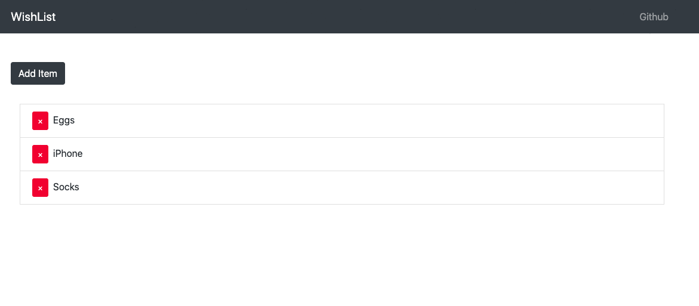

# Wishlist CRUD Web Application
## https://crud-wishlist.herokuapp.com/
Web application written with MERN stack where users can add and delete items for their personal wishlist.
## Instalation
Install Git and neccesary packages from packaje.json to run te web application on your local server

Clone this repo to your local machine using https://github.com/mikhailbudko/mern-wishlist
## Usage of Website
* #### Main Page
  Add and Delete items to create your personal wishlist  
  
* #### What technologies are you using for the project?
* MongoDB as the database for the project
* Express as the web application framework
* Node.js to configure the backend
* React for frontend
## Author 
* Mikhail Budko - Main Developer 
## Contact
* mikhail.budko@outlook.com
## License
This project is licensed under the MIT License - see the [LICENSE](https://github.com/mikhailbudko/csgo-predictions/blob/master/LICENSE) file for details.
